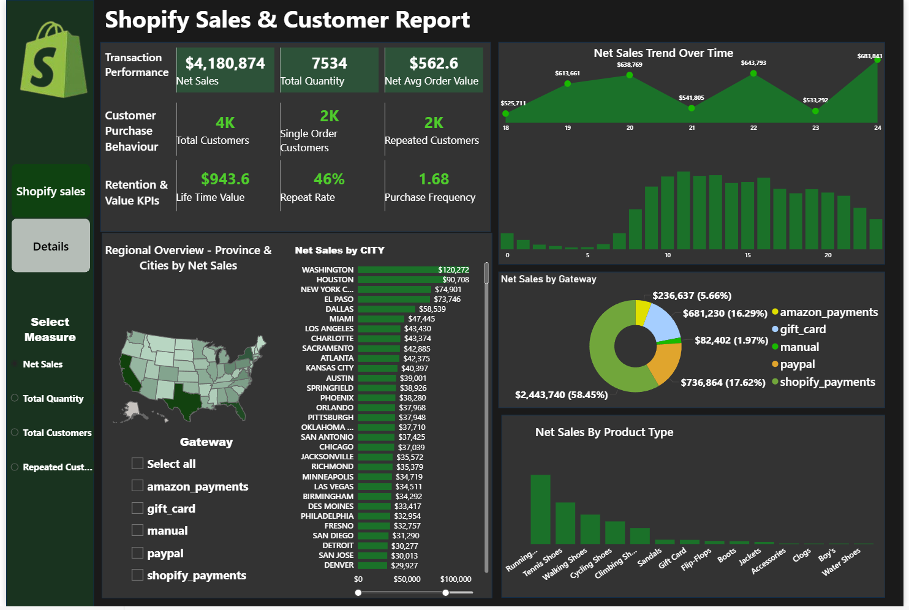

# Shopify Sales and Cusotmer Analytics Dashboard

## Project Overview
  This project presents an interactive Shopify Sales & Customer Analytics Dashboard designed 
to analyze sales performance, customer behavior, retention metrics, and regional insights.
  The dashboard is build using one week of shopify sales data, providing a focused short-term
performace analysis of revenue trends, customer purchase patterns and product performance
 
## Business Objective
- Monitor overall sales performance and orders
- Analze customer purchase begaviour and rentention
- Identify top-performing cities and product categories
- Evaluate payment gateway contribution to revenue

## Key Performance Indicators (KPIs)

## 1. Transaction Performance
- Net Sales: $4,180,874
- Total Quantity Sold: 7,534
- Average Order Value: $562.6
  
## 2. Customer Purchase Behaviour
- Total Customers: 4431
- Single Order Customers: 2392
- Repeated Customers: 2039

## 3.Redention and Value metrics
- Customer Lifetime Value: $943.6
- Repeat Rate: 46%
- Purchase Frequency: 1.68

## Dashboard Insights
## 1.Net Sales Trend Overtime
- Sales shows fluctuating but overall positive growth trend.
- peak revenue observed in the last date.
- Indicates consistent customer demand with seasonal variations.
## 2. Regional Sales Analysis
- Top-performing cities include Washington, Houston and New york.
- Certain provinces contributes significantly higher revenue.
- Enables geographic targeting for marketing campaings.
## 3. Sales by Payment Gateway
- Shopify payment contributes the highest revenue(58%)
- Paypal and gift cards are secondary contributors
Helps optimize payment gatway strategy and transaction fees.
## 4.Product Performance
- Running Shoes and Tennis Shoes are top-selling categories.
- Accessories and niche categories show lower contribution.
- Supports inventory and product focus decisions.

## Tools & Technologies Used
- Excel / CSV Dataset – Data Source
- DAX – Calculated Measures & KPIs
- Data Modeling – Relationship Management
- Power BI – Data Visualization & Dashboard Design

## Business Recommendations

- Focus marketing campaigns on high-performing cities.
- Introduce loyalty programs to improve repeat rate.
- Optimize inventory for top-selling product categories.
- Promote underperforming product categories through bundling.
- Evaluate payment gateway cost efficiency for higher profitability.

  

